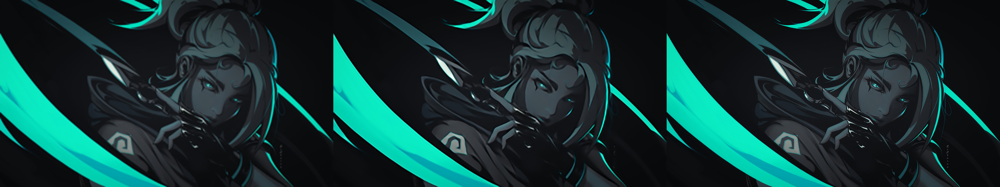
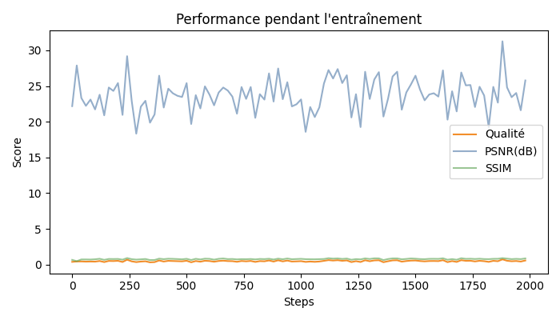

# LAESR - Line-Aware Edge and Spectrum Super-Resolution for Anime

  
   
  <em>Example upscaling result (V3): Original (left) → LAESR 4x (right)</em>

  
  <em>Latest update (V7):</em>
   

  
  <em>Training performances:</em>
   

## 🎯 Overview

LAESR (Line-Aware Edge and Spectrum Super-Resolution) is a specialized deep learning model designed specifically for anime and cartoon upscaling. Unlike generic super-resolution models, LAESR preserves the unique characteristics of anime art:

- **Sharp line art and contours**
- **Flat color regions**
- **Clean edges without artifacts**

### 🏗️ Architecture

LAESR combines three specialized branches:

- **Content Branch**: Lightweight residual feature extractor for general image content
- **Line Branch**: Fixed Sobel edge detector with learned refinement to sharpen contours
- **Spectrum Branch**: Frequency-aware enhancement via learnable low/high-frequency separation

## 📸 Results

### Before/After Comparisons

| Input (Low Resolution) | LAESR 4x Upscaled |
|:----------------------:|:-----------------:|
|  |  |

### Key Improvements
- ✅ Preserves sharp line art
- ✅ Maintains flat color regions
- ✅ Reduces compression artifacts
- ✅ No blurring or ringing artifacts

## 💻 Hardware Requirements

**Optimized for NVIDIA RTX 5070 (12GB VRAM)**
- GPU-first pipeline for training and inference
- Windows 10/11 supported
- Minimal CPU usage (I/O and video decoding only)

## 🚀 Quick Start

### 1. Install Dependencies

First, install PyTorch with CUDA support:
